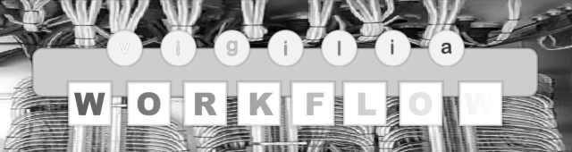

# Introduction

`workflow` and `vigilia` provide features that ensure a single "source
of truth" for documenting software project and systems.

The `workflow` engine automates and documents complex shell-based
tasks in software development.  It addresses the problem of technical
debt by making project execution workflows persistent, reproducible,
and easier to maintain.

The `vigilia` testing framework uses a database of test specifications
to generate documentation for user-facing functionality and to verify
that the delivered software meets the required application functions.


## `workflow` Applications

`workflow` engine configurations, applications and libraries are
typically developed in Python and have a license that is indepent of
`workflow`.  They can consequently be commercialized as a bridge
between Open Source Software and closed source software if feasible.

`workflow` applications can fall into one of several categories:

- Simple project wrapper that allows a developer to quickly find the
  tools and command lines required to carry out a given project.
- Library or executable wrapper,
- Infrastructure maintenance tool,
- Software component system integration and inspection.

`workflow` generates developer-facing documentation For each of these
catories as required.


### Simple `workflow` Applications

A simple `workflow` application centralizes and documents the tools
and command-line workflows required to work effectively on a project.

The `workflow` configuration implements bash completion in a minimal
project wrapper to standardize access to project-specific tooling and
exposes the exact command-line interfaces required to build, test,
deploy, or otherwise operate the project.

A `git ` repository for the configuration ensures that developers
share a common view on project execution.  The help pages of the
workflows are automatically collected in a manual per project stage.


### Library and Executable Wrappers

Typical `workflow` configuration examples of library and executable
wrappers are:

- Linux kernel testing and debugging: Compile a specific Linux kernel
  source tree and initiate debugging sessions under `qemu`.

- Yocto and Buildroot wrapping: Use the Yocto or Buildroot build
  systems more conveniently and leverage `workflow` `bash` completion
  to explore available `defconfig`s and recipes, and track which
  packages have already been built.  Advanced configuration allow
  starting `qemu` with a project specific Linux kernel and rootfs.


### Infrastructure Maintenance

- System diagnosis: System specific integration of the tools such as
  `ps`, `top`, `lsof`, `ss`, `systemctl`, `docker ps` to understand
  why a given process or service is running or why a given port is
  bound.  This allows to cross layers of supervisors, containers and
  services to find the root cause of a specific problem.  This type of
  `worfklow` configuration explains why a process exists, rather than
  just that it exists.

- IT network and infrastructure administration: Automate the IT
  administration tasks such as monitoring remote machines and
  inspection of registration details of a device inside a Docker
  container.  The `workflow` configuration offers a conceptual
  operational view on a complex IT network while still allowing
  inspection and configuration of all the network details.


### Software Component Integration Systems

- Device fleet simulation: Use of a build system such as Yocto or
  Buildroot for the integration of embedded software artifacts with
  open-source components, such as `qemu`, Grafana, Hawkbit and
  Guacamolee, required to simulate device fleet scenarios.


## `vigilia` Applications

`vigilia` was originally used as a first line documentation generation
system for the [GENESIS neural simulation
system](http://genesis-sim.org/):

- Unit, regression and integration testing: Starting `vigilia` from a
  `cron` job implements the execution of tests to catch error
  introduced by new development early.
- Static HTML web site generation: Specific test specifications model
  real use cases and form the basis for documentation writers to
  develop tutorial materials.
- Manual generation: The inline description of selected tests are
  converted to a PDF document that forms the foundation of
  specification and user manuals.


## Technical Details

__The Workflow Automation Engine__

The `workflow` engine helps automate complex system shell tasks during
software development.

Typical workflows include running local or remote shell commands with
hard-to-remember arguments and options, compiling source code on a
build server, converting documentation into web pages, flashing binary
software images (such as a Linux kernel) to small or embedded devices,
and orchestrating command sequences across local, remote, or virtual
machines.

The `workflow` engine provides the following capabilities:

- Convenient implementation of modular, custom workflows integrated
  with `bash` completion and automatically generated help pages.
- Simple creation of new projects, new _targets_, and new _commands_.
- Integration with Bash completion enables browsing of
  project-specific _targets_, _commands_, and _configurations_.
- Integration with `grc` for project-specific _keyword highlighting_.
- Support for multiple _roles_ for remote execution in a Docker
  containers or `tmux` sessions.


The `workflow` engine is typically used to:

- Organize, orchestrate and integrate software components into a
  cohesive system.
- Separate the configuration of Open Source Software components from
  commercial ones.
- Ensure reproducibility and traceability throughout the software
  development lifecycle.
- Maintain consistency and standardization across diverse development
  environments.
- Facilitate collaboration by providing a common framework for
  defining and executing project workflows organized in a `git`
  repository.


__The `vigilia` Tester__

The `vigilia` tester is based on a declarative database of test
specifications to:

- Execute tests and report on software application behavior.
- Query the test specifications as a knowledge base of implemented,
  required or desired application functions.
- Organize test specifications into hierarchically layers and
  categorize them using tags.
- Generate documentation for user-visible functionality.
- Isolate test environments using virtualization.


<!-- ## Abstract -->

<!-- Software documentation management systems face three long-standing -->
<!-- challenges: (1) Consistent software documentation synchronization with -->
<!-- system function, (2) Satisfy industry certification schemes, (3) -->
<!-- Document workflows required for project execution, collaboration -->
<!-- between software developers and reduce on-boarding time of new -->
<!-- developers. -->

<!-- Two complimentary software applications are introduced: `workflow` and -->
<!-- `vigilia`.  Together, they elaborate a multipolar view of the -->
<!-- implementation of a software documentation project while allowing -->
<!-- refinement during project development. -->

<!-- `workflow` automates the technical workflows required for project -->
<!-- development.  Its descriptions are based on system shell commands -->
<!-- through a set of configuration files. -->

<!-- Separation of project specific workflow configurations supports -->
<!-- collaboration between software developers through a shared git -->
<!-- repository. -->

<!-- The configuration files implement, automate, track and document the -->
<!-- execution of a series of system shell commands across machines used -->
<!-- for multi-role compilations, builds, tests and deployment. -->

<!-- A tester tool, `vigilia` isolates declarative test descriptions from -->
<!-- their execution. -->

<!-- These descriptions facilitate layering of the documentation levels -->
<!-- required for industry compliance and certification. -->

<!-- Specific features of test descriptions can be tagged for inclusion in -->
<!-- documents derived from the tests. -->

<!-- Combining these features guarantees a single “source of truth” -->
<!-- ensuring software system tests, documents and software functions -->
<!-- remain coherently synchronized. -->


# Installation

`workflow` and `vigilia` are available for most Linux distributions.
The regression tests use Docker files to install and verify
functionality on Debian, Ubuntu, Fedora and OpenSUSE.  The package
lists within these Dockerfiles document the prerequisites for each of
those distributions (Dockerfile for
[Debian](https://github.com/HugoCornelis/workflow-automation-engine/blob/master/vigilia/specifications/dockerfiles/Dockerfile.workflow-install-testing-debian),
[Ubuntu](https://github.com/HugoCornelis/workflow-automation-engine/blob/master/vigilia/specifications/dockerfiles/Dockerfile.workflow-install-testing-ubuntu),
[Fedora](https://github.com/HugoCornelis/workflow-automation-engine/blob/master/vigilia/specifications/dockerfiles/Dockerfile.workflow-install-testing-fedora),
[OpenSUSE](https://github.com/HugoCornelis/workflow-automation-engine/blob/master/vigilia/specifications/dockerfiles/Dockerfile.workflow-install-testing-opensuse)).

The following section provides manual installation instructions for
Ubuntu.


## Prerequisites

`workflow` and `vigilia` use [YAML](https://yaml.org/),
[JSON](https://toml.io/en/) and [TOML](https://toml.io/en/) for
configuration files.  They require the Perl modules `File::chdir`, and
`File::Find::Rule`, as well as the Perl module for integration of
Python code into Perl[^1].  `workflow` also relies `grc` for colorized
output.  Installation itself is handled via `autotools` and `make` and
requires `gcc` to compile C code.

As an example, for Ubuntu 22.04.3 LTS (Jammy), the following
prerequisites must be installed:

```
sudo apt install automake
sudo apt install grc
sudo apt install libexpect-perl
sudo apt install libfile-chdir-perl
sudo apt install libfile-find-rule-perl
sudo apt install libinline-python-perl
sudo apt install libjson-perl
sudo apt install libnet-ip-perl
sudo apt install libtoml-perl
sudo apt install libyaml-perl
sudo apt install make
```

[^1]: The Perl module that integrates with Python is called Inline::Python.  This module currently has a bug that generates warnings when multiple Python source code files are inlined.  A fix is available from https://github.com/niner/inline-python-pm but this fix is not available from package managers yet.


## Installation

First clone this repository into a local directory:

```
git clone https://github.com/HugoCornelis/workflow-automation-engine.git
cd workflow-automation-engine
```

Generate the `configure` script:

```
./autogen.sh
```

Then install `workflow` and `vigilia` using `configure` and `make`:

```
./configure
make
sudo make install
```

`workflow` and `vigilia` are now installed on your system.


# Using `workflow` and `vigilia`

## Starting a New `workflow` Project

To start a new `workflow` project named *foo*, follow these steps:

1. `workflow builtin start_project foo`

	Creates a workflow configuration for the new project named *foo*.

2. `workflow builtin install_scripts -- --commands --git`

	Makes the configuration available from any directory and
    initializes a `git` repository for it.

3. `foo-workflow --help-commands`

	Optionally displays the available commands for the project *foo*.

4. `foo-workflow examples_sh sh_single_command`

	By default the `workflow` engine installs a several example
    commands that can be adapted to your project's needs.  Use the
    `--dry-run` option to see the commands that would be executed, or
    use the `--interactions` option to see the commands and the role
    which would execute them.

5. `foo-workflow builtin add_target -- bar "Add commands to this new target that do new things" --install-commands-sh`

	Adds a new target *bar* and creates a directory with template
    examples that you can customize for your project.


## Starting a new `vigilia` project

To start a new `vigilia` project named *bar*, follow these steps:

1. `vigilia configuration-create bar alpha`

	Creates a new configuration for the project bar with the role alpha.

2. `vigilia module-create 100_test_module`

	Creates a new test module named `100_test_module`.

3. `vigilia command-add 100_test_module a_tested_command "This test tests 'a_tested_command' and expects the output it currently generates`

	Adds a test command to the module that verifies the behavior of
    `a_tested_command` and checks its output against the expected
    result.

Note: This section is under development.


